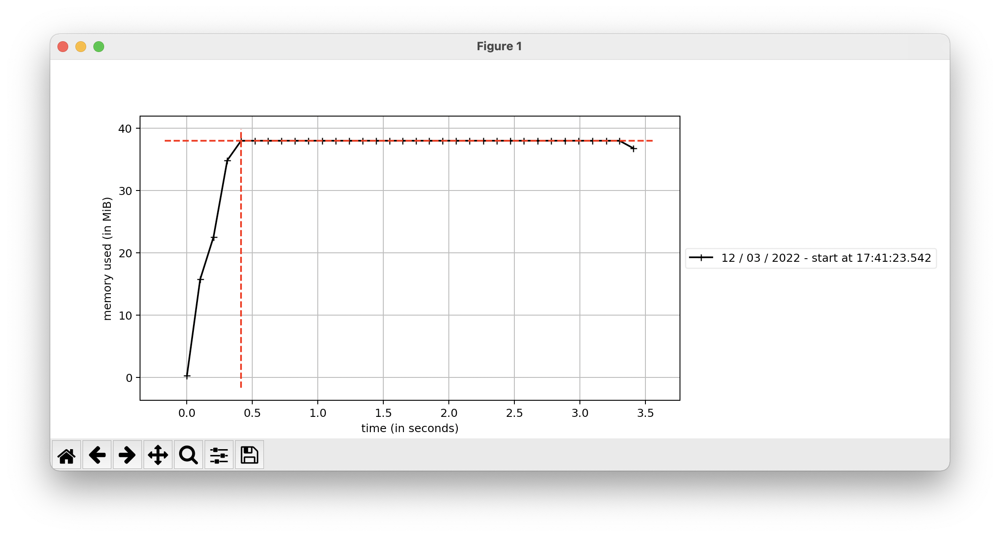

# Debug

- Youtube: [Thinking about Concurrency, Raymond Hettinger, Python core developer](youtube.com/watch?v=Bv25Dwe84g0&t=640s) 10m 40s

## pdb

- [Python Debugger](https://docs.python.org/3/library/pdb.html)
  - [commands](https://docs.python.org/3/library/pdb.html#debugger-commands)

```py
import pdb; pdb.set_trace()
```

### Commands

- ?: help
- l: list
- n: next
- c: continue
- s: step
- r: return
- b: break

## timeit

- [timeit](https://docs.python.org/3/library/timeit.html)

## profiling

- [cProfile](https://docs.python.org/3/library/profile.html)

Deterministic profiling of Python programs.

- `ncalls`: for the number of calls.
- `tottime`: for the total time spent in the given function (and excluding time made in calls to sub-functions)
- `percall`: is the quotient of tottime divided by ncalls
- `cumtime`: is the cumulative time spent in this and all subfunctions (from invocation till exit). This figure is accurate even for recursive functions.
- `percall`: is the quotient of cumtime divided by primitive calls
- `filename:lineno(function)`: provides the respective data of each function

### Run

```bash
python -m cProfile dequeue.py
```

Result:

```bash
Q: deque(['1', '2', '3', '4', '5', '6'])
Q: deque(['1', '2', '3', '4', '5', '6', '7'])
Q: deque(['0', '1', '2', '3', '4', '5', '6', '7'])
         8 function calls in 0.000 seconds

   Ordered by: standard name

   ncalls  tottime  percall  cumtime  percall filename:lineno(function)
        1    0.000    0.000    0.000    0.000 dequeue.py:1(<module>)
        1    0.000    0.000    0.000    0.000 {built-in method builtins.exec}
        3    0.000    0.000    0.000    0.000 {built-in method builtins.print}
        1    0.000    0.000    0.000    0.000 {method 'append' of 'collections.deque' objects}
        1    0.000    0.000    0.000    0.000 {method 'appendleft' of 'collections.deque' objects}
        1    0.000    0.000    0.000    0.000 {method 'disable' of '_lsprof.Profiler' objects}
```

## line_profiler

- GitHub: [rkern/line_profiler](https://github.com/rkern/line_profiler)

```bash
pip install line_profiler
```

### kernprof

```bash
python -m kernprof -l profile_decorator.py
```

Result:

```bash
Slow Function Executed
Fast Function Executed
Wrote profile results to profile_decorator.rpy.lprof
```

### Check `.py.lprof`

```bash
python -m line_profiler profile_decorator.py.lprof
```

Result:

```bash
Timer unit: 1e-06 s

Total time: 2.00395 s
File: profile_decorator.py
Function: slowFunction at line 5

Line #      Hits         Time  Per Hit   % Time  Line Contents
==============================================================
     5                                           @profile
     6                                           def slowFunction():
     7         1    2003875.0 2003875.0    100.0      time.sleep(random.randint(1, 3))
     8         1         76.0     76.0      0.0      print('Slow Function Executed')
```

## memory profiler

- GitHub: [pythonprofilers/memory_profiler](https://github.com/pythonprofilers/memory_profiler)

```bash
pip install -U memory_profiler
```

### Test

```bash
python -m memory_profiler profile_decorator.py
```

Result:

```bash
Slow Function Executed
Fast Function Executed
Filename: profile_decorator.py

Line #    Mem usage    Increment  Occurrences   Line Contents
=============================================================
     5   38.203 MiB   38.203 MiB           1   @profile
     6                                         def slowFunction():
     7   38.207 MiB    0.004 MiB           1       time.sleep(random.randint(1, 3))
     8   38.211 MiB    0.004 MiB           1       print('Slow Function Executed')
```

## mprof

### install

```bash
pip install matplotlib
```

### Run

```bash
mprof run profile_mprof.py
```

Result:

```bash
mprof: Sampling memory every 0.1s
running new process
running as a Python program...
Slow Function Executed
Fast Function Executed
```

### plot

```bash
mprof plot
```


